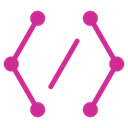

<div align="center" style="text-align: center;">


# Graph DOM
</div>

[](https://circleci.com/gh/t28hub/graph-dom/tree/master)
[](https://app.dependabot.com/accounts/t28hub/repos/202957325)
[](https://app.fossa.com/projects/git%2Bgithub.com%2Ft28hub%2Fgraph-dom?ref=badge_shield)

Extract web data by GraphQL and DOM API. [Demo](https://graph-dom.t28.now.sh/)  
:warning: This application is a proof of concept and might not be suitable for production.

## Key Features
* Support APIs like DOM API
* Custom HTTP Headers and HTTP Cookies
* Emulate devices and User-Agent
* Render JavaScript
* Support robots.txt
* Protect your privacy using incognito mode

## Example
```graphql
{
  page(url: "https://speakerdeck.com/p/featured") {
    decks: querySelectorAll(selector: "div.container div.mb-5") {
      title: querySelector(selector: "a") {
        text: getAttribute(name: "title")
      }
      link: querySelector(selector: "a") {
        href: getAttribute(name: "href")
      }
      image: querySelector(selector: "div.deck-preview") {
        thumbnail: getAttribute(name: "data-cover-image")
      }
      meta: querySelectorAll(selector: "div.deck-preview-meta > div.py-3") {
        value: innerText
      }
    }
  }
}
```
See [examples](./examples) for more detailed examples.

## Environment Variables
Environment variables are the follows and every variable is optional.
* `NODE_ENV`: `development` or `production`.(Defaults to `development`)
* `SERVER_PORT`: Port listened by the GraphDOM.(Defaults to `8080`)
* `LOG_LEVEL`: `DEBUG`, `INFO`, `WARN`, `ERROR` or `TRACE`.(Defaults to `INFO`)
* `APOLLO_API_KEY`: API key for the Apollo [GraphManager](https://engine.apollographql.com/).
* `APOLLO_SCHEMA_TAG`: Tag name of a GraphQL schema.
* `BROWSER_PATH`: Path to a browser.(Defaults to detect automatically)
* `BROWSER_HEADLESS`: Whether to launch browser in headless mode.(Defaults to `true`) 
* `QUERY_COMPLEXITY_LIMIT`: Maximum allowed complexity for query.(Defaults to `15`)
* `QUERY_DEPTH_LIMIT`: Maximum allowed depth for query.(Defaults to `5`)
* `REDIS_URL`: URL used to connect to Redis. If the environment variable is not set, the GraphDOM uses in-memory as a cache.

See [.env.example](./.env.example) for more detailed variables.

## Development
```
docker-compose up
```
GraphDOM will be running at `http://localhost:8080` and endpoint will be available.
And also Playground will be running at `http://localhost:8080/graphql`, if `NODE_ENV` is `development`.
```
http;//localhost:8080/graphql
```

The 'ping' query is useful to check whether GraphDOM works.
```
curl \
-H 'Content-Type: application/json' \
-X POST http://localhost:8080/graphql \
-d '{"query":"{ping}"}'
```
The request should receive the following response, if GraphDOM works appropriately.
```json
{
  "data": {
    "ping": "pong"
  }
}
```

## License
[](https://app.fossa.com/projects/git%2Bgithub.com%2Ft28hub%2Fgraph-dom?ref=badge_large)
